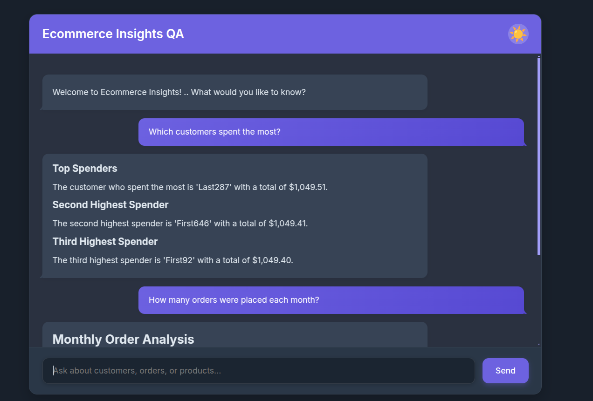

# RAG Pipeline API with PostgreSQL and Ollama

This project implements a Retrieval-Augmented Generation (RAG) pipeline as a FastAPI endpoint, using PostgreSQL and LLaMA-3.2 via Ollama.

## Prerequisites
- Python 3.8+
- PostgreSQL database (`Ecommerce` in this example)
- Ollama installed and running with LLaMA-3.2 model (`llama3.2`)

`ollama pull llama3.2`


## Installation
1. Clone the repository:
   ```bash
   git clone https://github.com/abdelmageed95/Chat-with-your-local-SQL-database-
2. Setup virual environment
   ```bash
   python3 -m venv myenv
   source myenv/bin/activate
3. install requirements
   ```bash
   pip install -r requirements.py
4. Run the app
   ```bash
   uvicorn api:app --host 0.0.0.0 --port 8000 --reload



